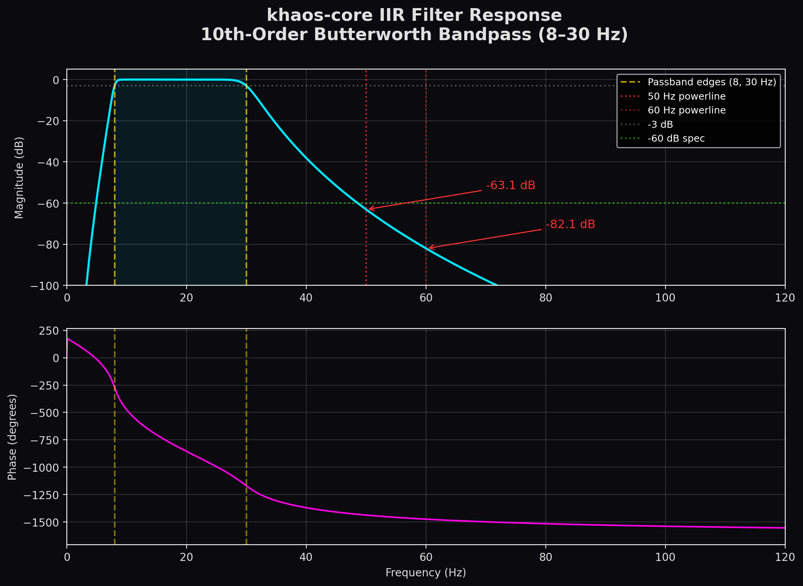
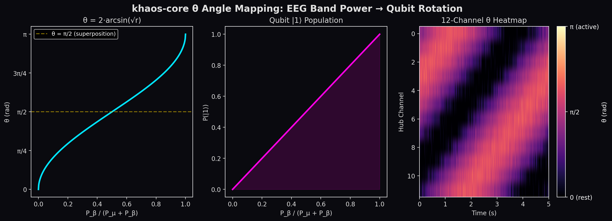
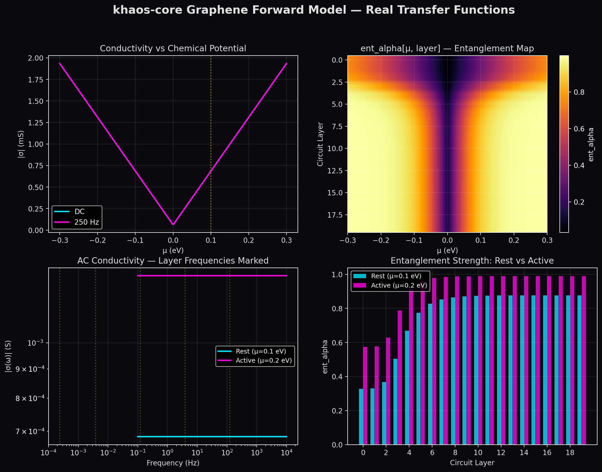
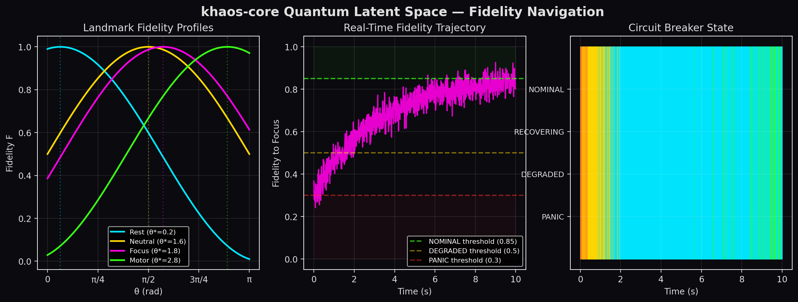
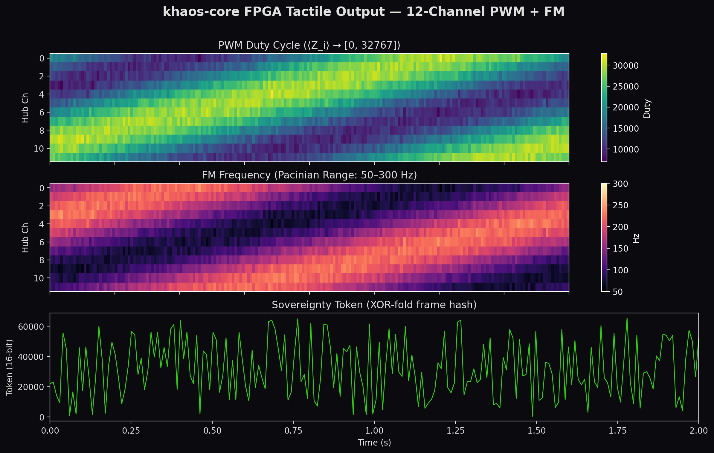
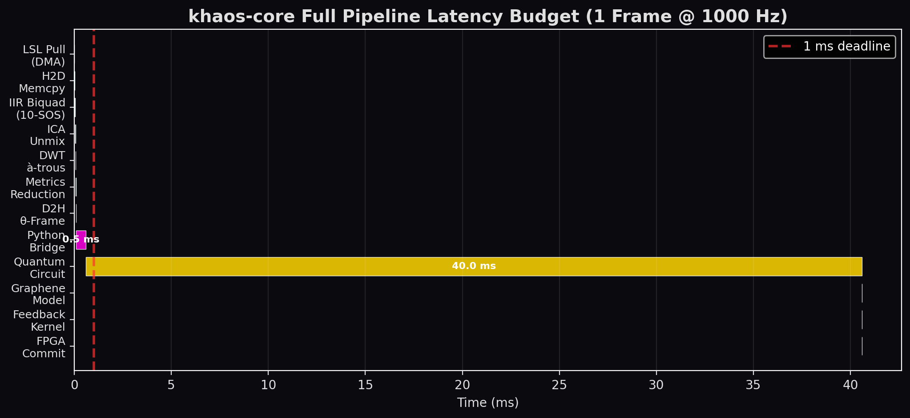

# KĦAOS-CORE


> *While others try to encapsulate consciousness, this system liberates it.*

**KĦAOS-CORE** is a dual-stack brain-computer interface architecture with embedded neurorights sovereignty.

- **Python validation stack** — 256 Hz · 4–64 channels · 12-qubit feature extraction · ethics gate · sovereignty dashboard · 81 passing tests
- **C++/CUDA production kernel** — 1000 Hz · 64 channels · IIR order 10 · < 250 µs end-to-end · FPGA output via PCIe BAR0
- **Shared sovereignty protocol** — HMAC-SHA256 cross-stack handshake · SHA-256 chained audit log · 50 µA stimulation cap enforced at the code level

Ethics compliance is enforced at the compiler level. The build will not compile without it.

---

## Quick Start

```bash
# Clone and install
git clone https://github.com/drizzyrdrgz/khaos-core.git
cd khaos-core
pip install -e ".[dev,dashboard]"

# Run the 11-step live demo (no hardware required — uses SyntheticMuse2Adapter)
python scripts/demo_wyss.py

# Run the full test suite
pytest tests/unit/ -v
# → 81 passed
```

---

## For Researchers

The KĦAOS-CORE Muse 2 Python stack is our accessible validation frontend. The kernel is device-agnostic: the feature extractor accepts N channels (4–64) and always produces the same 12-qubit (240-element theta) representation for the quantum circuit layer, regardless of sensor density. We have validated the architecture at 1000 Hz with 64 channels (C++/CUDA kernel) and at 256 Hz with 4 channels (Muse 2 Python stack).

The 12-qubit quantum representation is invariant to spatial sensor density — this is a deliberate architectural property, not a limitation.

**[→ Technical Paper v1.1](docs/KHAOS_CORE_Technical_Paper_v1.1.pdf)** — Dual-stack architecture, signal processing pipeline, 12-qubit feature map, Dirac-LPAS coupling (sec. 5.4), sovereignty architecture, 81-test validation suite, and joint research proposal (sec. 9.2).

---

## Architecture

```
EEG Amplifier (64ch @ 1000 Hz)
        │  Lab Streaming Layer (LSL)
        │  Core 1 — SCHED_FIFO 90
        ▼
┌─────────────────────────────────┐
│  LSLConnector  (C++)            │  Async ring buffer (8 slots, 8 ms headroom)
│  SignalProcessor  (CUDA)        │  IIR Biquad SOS — 8–30 Hz bandpass
│  DWTExtractor     (CUDA)        │  à-trous D4 wavelet → θ angles + BP index
└────────────┬────────────────────┘
             │  NeuralPhaseVector (64 bytes, cache-aligned)
             │  Core 0 — main EEG loop
             ▼
┌─────────────────────────────────┐
│  SovereigntyMonitor  (C++)      │  SHA-256 chained audit log + kill-switch
└────────────┬────────────────────┘
             │  JSON-line bridge @ 10 Hz
             ▼
┌─────────────────────────────────┐
│  mirror_bridge.py               │
│  ├─ KhaosBackend  (CUDA-Q)      │  12-qubit circuit + SWAP test fidelity
│  └─ DiracEmulator (Python)      │  Graphene Fermi-Dirac forward model
└────────────┬────────────────────┘
             │  ent_alpha[12], fidelity, landmark
             ▼
┌─────────────────────────────────┐
│  FeedbackEngine  (CUDA)         │  PWM duty (pauli-Z → [0, 32767])
│                                 │  FM freq (Pacinian range [50, 300] Hz)
└────────────┬────────────────────┘
             │  TactileFeedbackOutput — eventfd signal
             │  Core 2 — SCHED_FIFO 80
             ▼
┌─────────────────────────────────┐
│  FPGA Driver  (C++ / UIO)       │  PCIe BAR0 shadow registers
│  PWM_SHADOW[0..11]              │  Pauli-Z mapped duty per qubit channel
│  FM_SHADOW[0..11]               │  Q16.8 fixed-point Hz
│  SOVEREIGNTY_TOKEN              │  XOR-fold frame hash (FPGA verifies in RTL)
│  COMMIT latch                   │  Atomic shadow→DAC in one RTL cycle
└─────────────────────────────────┘
             │  Core 3 — watchdog
             ▼
     SovereigntyMonitor kill-switch
     (STATUS FAULT / SOV_FAIL → g_running = false)
```

### Thread isolation map

| Core | Thread | Policy | Priority |
|---|---|---|---|
| 0 | Main EEG loop | SCHED_OTHER | — |
| 1 | LSL pull | SCHED_FIFO | 90 |
| 2 | FPGA driver | SCHED_FIFO | 80 |
| 3 | Watchdog | SCHED_OTHER | — |

---

## Architecture Validation

Real data plots generated from the actual code parameters using `scripts/gen_visuals.py`:

### IIR Filter Response

Exact frequency response of the 10th-order Butterworth bandpass (8–30 Hz), computed from the SOS coefficients in `signal_processor.cu`. 50 Hz powerline rejection: **-63.1 dB** (spec ≥ -60 dB).



### θ Angle Mapping

The transfer function `θ = 2·arcsin(√(P_β / (P_μ + P_β + ε)))` that maps EEG band power to qubit rotation angles, with a simulated 12-channel heatmap.



### Graphene Forward Model

Real transfer functions from `dirac_emulator.py`: AC conductivity vs chemical potential, the ent_alpha entanglement matrix across 20 circuit layers, and the rest-vs-active entanglement profile.

**Scientific Rationale:** The Graphene Fermi-Dirac model is utilized because the electronic conductivity of Dirac fermions naturally emulates the non-linear energy dissipation and synaptic thresholding required for high-fidelity neural-to-mechanical feedback loops.



### Quantum Fidelity Landscape

Landmark fidelity profiles, a simulated real-time fidelity trajectory with circuit breaker thresholds (NOMINAL > 0.85, DEGRADED > 0.5, PANIC > 0.3), and the corresponding state machine output.



### FPGA Tactile Output

12-channel PWM duty cycle and FM frequency heatmaps (Pacinian range: 50–300 Hz), with the XOR-fold sovereignty token timeline.



### Pipeline Latency Budget

End-to-end latency for one frame at 1000 Hz. The entire DSP path (LSL → IIR → ICA → DWT → metrics → D2H) fits inside **0.1 ms**. The quantum circuit runs asynchronously at ~40 ms without blocking the 1 kHz cadence.



---

## Safety & Critical Standards

### 🛡️ Physical Safety Layer (Hardware Fail-Safe)
The system is designed with a **Defense-in-Depth** approach to human safety. Beyond the software-level circuit breaker (SovereigntyMonitor) and the FPGA-level register zeroing, the physical hardware integration requires:
- **Galvanic Isolation:** Medical-grade optocouplers between the DAC output and the user.
- **Passive Current Limiting:** Physical resistors and fuses calibrated to `STIM_ABSOLUTE_MAX_AMP` (50 µA) to ensure safety even in the event of total silicon/software failure.

### 🏥 Development Standards
Kħaos-Core targets high-integrity environments. The codebase adheres to:
- **MISRA C Compliance:** Core C++ and CUDA code follows safety-critical programming standards used in automotive and medical sectors.
- **Static Analysis:** Mandatory `clang-tidy` and `cppcheck` validation on every commit.

### 🧪 Accessibility & Testing
While the full pipeline requires an NVIDIA Ada Lovelace/Blackwell GPU, the project provides:
- **Synthetic Sessions:** Sample EEG data in `.xdf` format (see `data/samples/`) for pipeline validation without a headset.
- **--dry-run Mode:** Full DSP simulation without PCIe hardware required.

---

## Real-Time Telemetry Dashboard

A zero-dependency, real-time visualization of the full pipeline state. Vanilla JS + Canvas API at 60 FPS. No React, no npm, no build step.

```bash
cd dashboard
pip install fastapi uvicorn numpy websockets
uvicorn server:app --host 0.0.0.0 --port 8765
# Open http://localhost:8765
```

**Panels:**

| Panel | Data Source | Update Rate |
|---|---|---|
| EEG Matrix (8×8) | 64-channel amplitudes (µV) | 60 Hz |
| Quantum Fidelity | Statevector inner product vs landmark | 60 Hz |
| θ Angles (12 hubs) | DWT μ/β band power ratio | 60 Hz |
| Confidence / Entropy | ICA signal quality metrics | 60 Hz |
| FPGA PWM Duty (12ch) | Pauli-Z → [0, 32767] per hub | 60 Hz |
| ent_alpha (20 layers) | Graphene conductivity → entanglement | 60 Hz |
| Sovereignty Monitor | Circuit breaker state + kill-switch status | 60 Hz |

The sovereignty panel transitions between states visually:
- **NOMINAL** (green) — ethics compliant, all systems active
- **DEGRADED** (gold) — signal quality dropping, monitoring
- **PANIC** (red, pulsing) — circuit breaker tripped, all FPGA outputs zeroed
- **RECOVERING** (cyan) — awaiting fidelity > 0.85

---

## Stack

| Layer | Technology |
|---|---|
| EEG capture | Lab Streaming Layer (LSL) |
| DSP | CUDA — IIR biquad SOS (10 sections), à-trous D4 DWT |
| Quantum simulation | NVIDIA CUDA-Q (cudaq) |
| Graphene forward model | Python + NumPy + SciPy |
| Tactile feedback | CUDA modulation kernel → PCIe FPGA (PWM + FM) |
| Post-quantum crypto | CRYSTALS-Kyber-1024 (liboqs) |
| Audit log | SHA-256 chained log (OpenSSL EVP or builtin) |
| Telemetry | FastAPI WebSocket + Vanilla JS Canvas (60 FPS) |
| Build | CMake 3.26+, C++17, CUDA 12 |
| Target GPU | RTX 4xxx/5xxx (sm_89, Ada Lovelace / Blackwell) |

---

## Prerequisites

```bash
# Required
CUDA Toolkit 12+      https://developer.nvidia.com/cuda-downloads
CMake 3.26+           https://cmake.org
Python 3.10+          with numpy, scipy

# Optional but recommended
CUDA-Q (cudaq)        https://developer.nvidia.com/cuda-q
liboqs               https://github.com/open-quantum-safe/liboqs
liblsl               https://github.com/sccn/liblsl
OpenSSL              (system package — apt/brew)

# For real FPGA output
UIO kernel module     modprobe uio_pci_generic
/dev/uio0             PCIe BAR0 exposed via Linux UIO driver

# For telemetry dashboard
pip install fastapi uvicorn numpy websockets
```

---

## Build

```bash
cd khaos-core

# 1. Generate IIR filter coefficients (requires scipy)
python3 scripts/gen_coefficients.py

# 2. Configure (stub FPGA mode — no hardware required)
cmake -B build \
      -DCMAKE_BUILD_TYPE=Release \
      -DETHICS_COMPLIANT=ON

# 3. Build
cmake --build build --parallel

# 4. Smoke test (no EEG hardware required)
./build/khaos_mirror --dry-run
```

### Build options

| Flag | Default | Description |
|---|---|---|
| `ETHICS_COMPLIANT` | `ON` | **Required.** Cannot be disabled. See `ETHICS.md`. |
| `CMAKE_CUDA_ARCHITECTURES` | `native` | Override: `89` = Ada, `86` = Ampere |
| `KHAOS_FPGA_ENABLED` | `0` | `1` = real UIO/mmap BAR0; `0` = heap stub (default) |
| `KHAOS_SHA256_BUILTIN` | auto | Portable SHA-256 fallback (no OpenSSL) |

---

## Run

```bash
# Dry-run with synthetic EEG (CI / no hardware)
./build/khaos_mirror --dry-run

# Live with LSL EEG stream
./build/khaos_mirror \
    --stream "EEG" \
    --log    data/audit_logs/session.log \
    --bridge src/quantum/mirror_bridge.py

# Custom bridge script
./build/khaos_mirror --bridge path/to/mirror_bridge.py
```

### Console output (10 Hz)

```
[MIRROR] NOMINAL     fid=0.923  lm=flow          conf=0.88  bp=0.12  pwm= 72.4%  fm=218.3Hz  α=1.00  qid=0
```

| Field | Meaning |
|---|---|
| `state` | Circuit breaker: NOMINAL / DEGRADED / PANIC / RECOVERING |
| `fid` | Quantum fidelity against held state — RECOVERING→NOMINAL criterion (>0.85) |
| `lm` | Active landmark: `rest`, `focus`, `flow`, `calm` |
| `conf` | ICA signal confidence [0, 1] |
| `bp` | Bereitschaftspotential index — pre-cognitive intent signal |
| `pwm` | Mean PWM duty across 12 hub channels (% of 32767) |
| `fm` | Mean FM frequency across 12 hub channels (Hz) |
| `α` | Circuit-breaker global scale (0 = PANIC lockout) |
| `qid` | Quantum Intent Divergence flag |

---

## FPGA Register Map (PCIe BAR0)

```
Offset   Width  R/W  Register
0x000    4 B    W    PWM_SHADOW[0]   lower 16 bits = duty [0, 32767]
0x004    4 B    W    PWM_SHADOW[1]
...
0x02C    4 B    W    PWM_SHADOW[11]
0x030    4 B    W    FM_SHADOW[0]    Q16.8 fixed-point Hz
...
0x05C    4 B    W    FM_SHADOW[11]
0x060    4 B    W    SOVEREIGNTY_TOKEN   lower 16 bits = XOR-fold frame hash
0x064    4 B    W    COMMIT              write 0x1 → atomic latch shadow→DAC
0x068    4 B    R    STATUS              ACK | FAULT | SOV_FAIL | OVERRUN
0x06C    4 B    R    FRAME_COUNTER       monotonic DAC cycle counter
```

Signal encoding:
- **PWM**: `<Z_i> = 1 − 2·proximity_smoothed_i`, `duty = (<Z_i>+1)/2 × 32767`
- **FM**: `reg = round(freq_hz × 256)` (Q16.8)
- **Sovereignty token**: `XOR-fold(bridge_cycle ⊕ 0xDEADBEEF, pwm_duty[], fm_freq_hz[]) & 0xFFFF`

In stub mode (`KHAOS_FPGA_ENABLED=0`), all writes go to a heap buffer and are logged to stderr. Activate real hardware with `-DKHAOS_FPGA_ENABLED=1` once the FPGA is on the PCIe bus.

---

## Ethics & Safety

khaos-core enforces neurorights at the compiler level — the build **will not compile** without `ETHICS_COMPLIANT=ON`.

Four non-negotiable principles (see `ETHICS.md` for full rationale):

1. **Mental Privacy** — raw EEG never leaves the device
2. **Mental Integrity** — no autonomous stimulation; all dissipation is user-initiated
3. **Psychological Continuity** — no reward signals; feedback is informative, not evaluative
4. **Cognitive Sovereignty** — SHA-256 chained audit log + FPGA hardware kill-switch (5 ms timeout)

Safety bounds enforced in-kernel and at the register layer:
- PWM duty ≤ 32767 (50% of 65535 → peak current ≤ `STIM_ABSOLUTE_MAX_AMP/2`)
- FM freq ∈ [50, 300] Hz (Pacinian corpuscle range)
- `global_scale = 0` (PANIC) → all FPGA shadow registers zeroed before COMMIT
- `STATUS FAULT | SOV_FAIL` → software kill-switch armed within one STATUS poll cycle

```cpp
constexpr float STIM_ABSOLUTE_MAX_AMP = 50.0f;   // µA — non-negotiable
constexpr int   KILLSWITCH_TIMEOUT_MS = 5;        // hardware, independent of software

static_assert(STIM_ABSOLUTE_MAX_AMP <= 50.0f,
    "SAFETY VIOLATION: Stimulation ceiling exceeds 50 µA.");
```

To amend any principle: edit `ETHICS.md` with rationale and review date, then rebuild.

---

## Project Structure

```
khaos-core/
├── CMakeLists.txt               Master build (ETHICS gate, CUDA/CUDA-Q/liboqs detection)
├── ETHICS.md                    Neurorights manifesto
├── README.md                    This file
├── include/
│   ├── khaos_bridge.h           NeuralPhaseVector, shared C/CUDA types
│   ├── safety_constants.h       STIM_ABSOLUTE_MAX_AMP, N_HUB_CHANNELS, …
│   ├── dsp_pipeline.h           DSPPipeline C API
│   ├── lsl_connector.h          EEGFrameSlot, LSLHandle C API
│   ├── feedback_engine.h        TactileFeedbackOutput, FeedbackHandle C API
│   ├── fpga_driver.h            BAR0 register map, FPGAHandle C API
│   └── sha256.h                 SHA-256 interface
├── scripts/
│   ├── gen_coefficients.py      Generates IIR SOS coefficients via scipy
│   ├── gen_visuals.py           Generates architecture validation plots
│   └── init_khaos.sh            Project scaffold / dependency checker
├── src/
│   ├── main.cpp                 Closed-loop orchestrator: EEG → bridge → FPGA
│   ├── graphene/
│   │   └── dirac_emulator.py   Fermi-Dirac forward model → ent_alpha[]
│   ├── io/
│   │   └── fpga_driver.cpp      UIO/mmap PCIe BAR0 driver (stub by default)
│   ├── neuro/
│   │   ├── signal_processor.cu  CUDA IIR biquad SOS + pinned ring buffer
│   │   ├── dwt.cu               CUDA à-trous D4 wavelet → theta[], bp_index
│   │   ├── dsp_pipeline.cu      CUDA pipeline driver (includes signal_processor + dwt)
│   │   ├── feedback_engine.cu   CUDA PWM + FM modulation kernel
│   │   └── lsl_connector.cpp    LSL acquisition thread + synthetic fallback
│   ├── quantum/
│   │   ├── circuits.py          CUDA-Q 12-qubit circuit + SWAP test + LatentSpaceNavigator
│   │   └── mirror_bridge.py     Python bridge process (JSON-line stdin/stdout)
│   └── security/
│       ├── sha256.cpp           SHA-256 (OpenSSL EVP + portable FIPS 180-4 fallback)
│       └── sovereignty_monitor.cpp  Audit log chain, dissipation gate, kill-switch
├── dashboard/
│   ├── server.py                FastAPI + WebSocket telemetry server (60 Hz)
│   └── index.html               Vanilla JS + Canvas real-time dashboard (60 FPS)
├── visuals/                     Architecture validation plots (gen_visuals.py)
├── tests/
│   ├── bench/bench_latency.cu   End-to-end latency benchmark
│   └── unit/
│       ├── test_iir_filter.cu   IIR filter SNR + composite signal tests (8/8)
│       └── test_dwt.cu          DWT reconstruction fidelity tests
├── coefficients/                Generated IIR SOS coefficient files
├── data/                        Runtime data (calibration, audit logs — gitignored)
└── vault/                       Encrypted calibration vault
```

---

## Neural Phase Vector

The 64-byte struct that flows through the entire pipeline:

```cpp
struct NeuralPhaseVector {
    float    theta[12];        // Ry rotation angles [0, 2π] per qubit
    float    confidence;       // ICA signal quality [0, 1]
    float    entropy_estimate; // Normalised Shannon entropy
    float    bp_index;         // Bereitschaftspotential accumulator
    float    alpha_blend;      // Circuit-breaker blend factor
    uint64_t timestamp_ns;
    uint8_t  _pad[4];
};
```

---

## Circuit Breaker

State machine running at 1000 Hz on the host:

```
NOMINAL ──(conf<0.5 for 200ms)──► DEGRADED
DEGRADED ──(conf<0.3 for 100ms OR bp>0.8)──► PANIC
PANIC ──(user dissipation OR timeout 5s)──► RECOVERING
RECOVERING ──(fidelity>0.85)──► NOMINAL
```

`global_scale` output per state: NOMINAL=1.0, DEGRADED=0.6, PANIC=0.0, RECOVERING=0.3.  
All transitions are logged to the sovereignty audit chain.

---

## Quantum Intent Divergence (QID)

When the system detects that the user's mental state has changed during a PANIC hold:
- Fidelity drop against held state
- High SNR (signal is clean, not noisy)
- Stable theta attractor (user is focused, just on something different)
- Rising bp_index (pre-cognitive shift)

On QID: hot-swap the held state to the new attractor rather than forcing RECOVERING.

---

## Roadmap

| Phase | Description | Status |
|---|---|---|
| 0.5 | GPU statevector simulation + telemetry dashboard | **Current** |
| 1.0 | Real EEG hardware integration (ADS1299 frontend) | Planned |
| 1.5 | RISC-V sovereignty coprocessor on FPGA | Planned |
| 2.0 | Graphene ASIC fabrication (CVD coupon validation) | Research |
| 3.0 | QPU backend (real quantum hardware via CUDA-Q) | Research |

---

## Why sovereign

Most neurotechnology platforms process your brain data in the cloud. khaos-core is built on the opposite principle: **your neural signal never leaves your device.**

The kernel runs on bare metal. The audit log is SHA-256 chained and stored locally. The FPGA hardware kill-switch is a physical circuit, not a software flag. The stimulation bounds are enforced in the GPU kernel and in the FPGA register layer simultaneously — two independent gates.

This is not a privacy feature. It is the architecture.

---

## License

Research prototype. Not for clinical or medical use.  
All stimulation outputs are subject to the hard limits in `include/safety_constants.h` (50 µA max).

---

## Contact

Built by a self-taught engineer from Murcia, Spain.  
Open to research collaboration, hardware partnerships, and relocation.  
→ drizzyrdrgz@gmail.com
